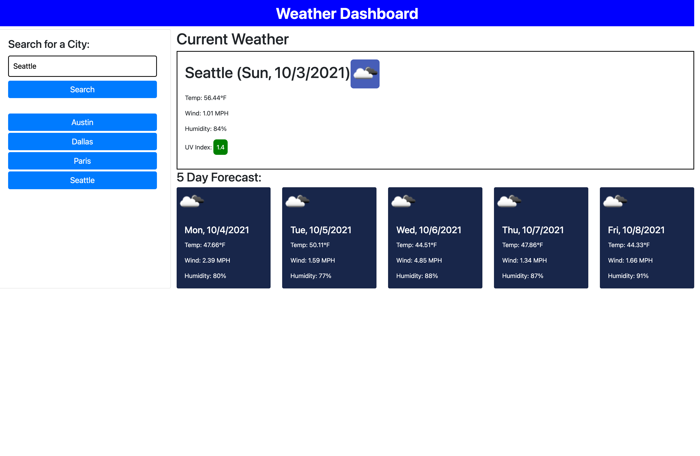

# weather-dashboard

## Description
This application allows users to plan for a trip according to the weather outlook of the searched city. Using the OpenWeather One Call API, when a user searches for any city in the world they are given a dashboard with the current conditions and 5-day forecast. The cities that have already been searched are stored locally while also appearing as a button as a search history that users can refer back to.

## Credit
Classmate Ethan helped with starting off HTML, converting the temperature to imperial, and overall talking out my logic and double checking my functions.  
Classmate Todd helped add degree character, adding the icon images.

## Future Development
5 day forecast API call responds with different data times to begin the array. Doesn't change functionality but does not give user the accurate high of the day.

## Links:
- GitHub Repo:https://github.com/suelee0308/weather-dashboard
- Deployed webpage:https://suelee0308.github.io/weather-dashboard/

## Screenshot:

